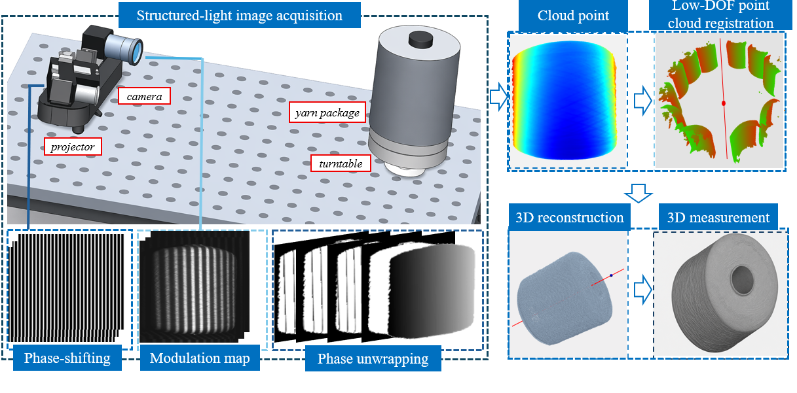
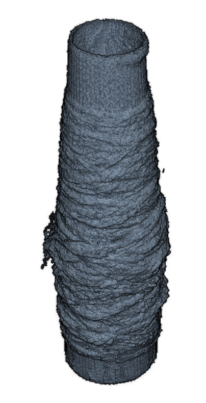
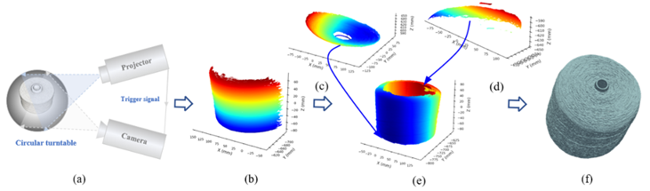
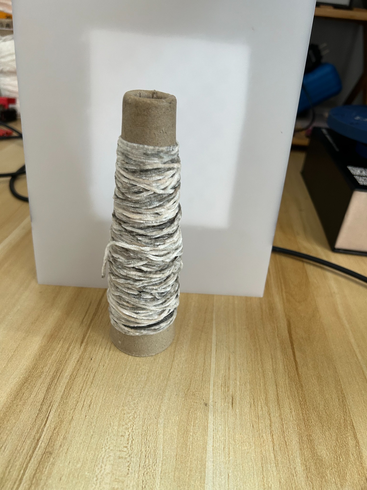

# RA-SCR-yarn-cheese-volume-measurement-structured-light
Description: Source code for rotation-axis constrained shared-cross-section registration and structured light volume measurement of yarn cheese packages.
# Rotation-Axis-Constrained Shared-Cross-Section Registration for Yarn Cheese Volume Measurement

This repository provides the source code and example results for a structured-light based 3D reconstruction and volume measurement method for yarn cheese packages.

The proposed method introduces a Rotation-Axis-Constrained Shared-Cross-Section Registration (RA-SCR) framework to improve multi-view point cloud fusion for approximately axisymmetric objects. By utilizing the turntable rotation axis as geometric prior information, the registration problem is converted from conventional 6-DoF rigid alignment into a low-dimensional optimization problem under cross-sectional constraints. A layered shared cross-section model is further introduced to achieve global geometric consistency among multiple point clouds.

The complete pipeline includes structured-light phase generation, phase unwrapping, camera-projector calibration, point cloud reconstruction, rotation-axis estimation, multi-view registration, and volume calculation.

## Pipeline Overview

## Reconstruction Results

Example reconstructed point cloud from the structured-light measurement system:

## Measurement Pipeline

The proposed method estimates yarn cheese geometric parameters and calculates the total package volume and yarn material volume using an axial-radial layered model.

## Example Sample

